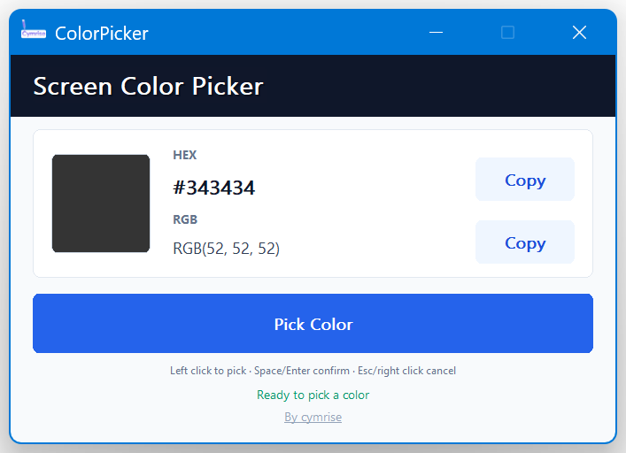

# ColorPicker

A lightweight native Windows screen color picker built with Win32 C++.

[Download the latest release](https://github.com/BearCubConstellation/ColorPicker/releases/latest)

## Downloads

The latest release contains two standalone Windows x64 packages:

- **Chinese**: `ColorPicker-v*-zh-CN-win-x64.zip`
- **English**: `ColorPicker-v*-en-US-win-x64.zip`

Extract the package and run the included `.exe`. No .NET, Java, VC++ Runtime, installer, external DLL, PDB, or configuration file is required.

## Screenshot / 效果图

<p align="center">
  
</p>

## Features

- Native Win32 C++ and static C++ runtime.
- Chinese and English executables built from the same source code.
- Compact tool-sized interface with Per-Monitor V2 DPI support.
- Clear visual hierarchy: larger HEX, RGB, Copy controls, and primary picker action.
- Unified Copy controls with the same blue-tinted appearance.
- Multi-monitor, negative-coordinate, and mixed-scaling support.
- Frozen desktop snapshot while picking: the screen behind the picker cannot receive clicks.
- Color preview lens follows the mouse in real time.
- The header title starts white and adopts the confirmed color after a pick.
- `By cymrise` opens an About window with a clickable GitHub project link.

## Usage

1. Run the language version you need.
2. Select **Pick Color** / **开始取色**.
3. Move the mouse over the frozen screen preview.
4. Left-click, `Space`, or `Enter` to confirm.
5. Right-click or `Esc` to cancel.

## Build

Development requires Windows, CMake, and Visual Studio Build Tools with Desktop C++:

```powershell
cmake -S native -B build -A x64
cmake --build build --config Release --target ColorPicker ColorPickerEn
```

Generated files:

```text
build\Release\ColorPicker.exe
build\Release\ColorPicker-en.exe
```

## Release process

`CHANGELOG.md` is the single source of truth for version history. To publish a release:

1. Update `VERSION`, file metadata, and `CHANGELOG.md`.
2. Commit and push the release commit to `main`.
3. Create and push a matching tag, for example `v1.3.2`.
4. The release workflow validates that the tag matches `VERSION`, builds both language editions, packages them, and creates the GitHub Release.

```powershell
git tag v1.3.2
git push origin v1.3.2
```

---

# ColorPicker

轻量级原生 Windows 屏幕取色工具，基于 Win32 C++ 实现。

[下载最新版本](https://github.com/BearCubConstellation/ColorPicker/releases/latest)

## 下载说明

最新版 Release 同时提供两个独立的 Windows x64 压缩包：

- **中文版**：`ColorPicker-v*-zh-CN-win-x64.zip`
- **英文版**：`ColorPicker-v*-en-US-win-x64.zip`

解压后直接运行对应语言的 `.exe` 即可。不需要安装 .NET、Java、VC++ Runtime，也不包含安装器、外部 DLL、PDB 或配置文件。

## 功能

- 原生 Win32 C++，使用静态 C++ 运行库。
- 中英文程序由同一份源码构建，功能保持一致。
- 紧凑小工具界面，支持 Per-Monitor V2 DPI 感知。
- HEX、RGB、复制按钮和主取色按钮采用更清晰、更大的信息层级。
- 两个复制按钮统一为相同的浅蓝视觉样式。
- 支持多显示器、负坐标和不同缩放比例。
- 取色时生成桌面快照并冻结画面，底层桌面不会接收点击。
- 当前颜色浮窗实时跟随鼠标。
- 顶部标题初始为白色，确认取色后会同步变为该颜色。
- 点击 `By cymrise` 可打开项目说明，并跳转至 GitHub 仓库。

## 使用方式

1. 启动所需语言版本。
2. 点击 **开始取色** / **Pick Color**。
3. 在冻结后的桌面预览中移动鼠标。
4. 左键、`Space` 或 `Enter` 确认。
5. 右键或 `Esc` 取消。

## 本地构建

开发环境需要 Windows、CMake 以及带 Desktop C++ 的 Visual Studio Build Tools：

```powershell
cmake -S native -B build -A x64
cmake --build build --config Release --target ColorPicker ColorPickerEn
```

生成文件：

```text
build\Release\ColorPicker.exe
build\Release\ColorPicker-en.exe
```

## 发版流程

`CHANGELOG.md` 是唯一的版本历史来源。发布新版本时：

1. 更新 `VERSION`、文件元数据与 `CHANGELOG.md`。
2. 将发版提交推送到 `main`。
3. 创建并推送对应版本标签，例如 `v1.3.2`。
4. Release 工作流会校验标签与 `VERSION` 一致，然后构建中英文版本、打包并创建 GitHub Release。

```powershell
git tag v1.3.2
git push origin v1.3.2
```